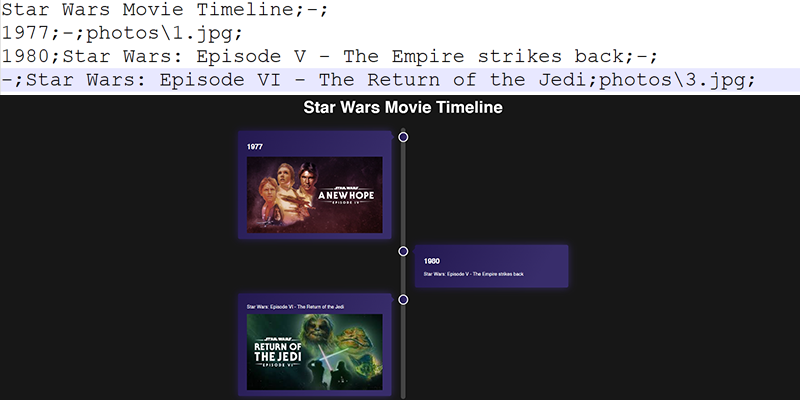

# __Web page maker__ #
This program allows you to create a custom timeline website


## __How to use__ ##
When launching this application, provide a data file name as a parameter:
```powershell
./WebPageMaker.exe data.txt
```
## __Data file format__ ##

**Incorrectly entered data leads to undefined behavior!**  
**Make sure to read correct data examples below!**

### Data file contents ###
The data file should **always** contain the following data:
- Timeline title
- Timeline description

### Additional info ###
The program works by parsing different data on a single time point. Each data segment (after Title and Description) is considered the data of a particular time point. Each time point ***requires*** specific data:
- Time point name (ex. `2020`, `Christmas`, etc.)
- Time point description (ex. `The year of a pandemic`, `Christmas is an annual festival`, etc.)
- Time point image (ex. `1.jpg`, `718110.png`, etc.)

### Data format ###
Each piece of information should be separated by a **semicolon**
```
Timeline Title;Timeline Description;
Timepoint_title1;Timepoint_description1;Timepoint_photo1;
Timepoint_title2;Timepoint_description2;Timepoint_photo2;
Timepoint_title3;Timepoint_description3;Timepoint_photo3;
...
```


### Alternate behaviors ###
Entering a `-` will not show the particular element on a page:
```
Timeline Title;Timeline Description;
Timepoint_title1;-;Timepoint_photo1;
Timepoint_title2;Timepoint_description2;-;
-;Timepoint_description3;Timepoint_photo3;
-;-;-;
...
```



Leaving all three slots empty `-;-;-;` will move the next time point to the same side as the previous
```
Timeline Title;Timeline Description;
Timepoint_title1;Timepoint_description1;Timepoint_photo1;
-;-;-;
Timepoint_title3;Timepoint_description3;Timepoint_photo3;
...
```


`Timeline Title` and `Timeline Description` can also be left blank (`-;-;`), in result no header will be created.

## __How to build__ ##
If trying to build from source, [CMake](https://cmake.org/) and [GCC](https://gcc.gnu.org/) is required. If [CMake](https://cmake.org/) is already installed, run these commands in directory containing **CMakeLists.txt**
```powershell
cmake -D CMAKE_C_COMPILER=<path-to-gcc> -G "MinGW Makefiles" -S . -B build/
cd build
mingw32-make
```

Made by [Laurynas Gailius](https://github.com/LorryGailius) and [Arnas Vaicekauskas](https://github.com/LionasBaslis2sis)
